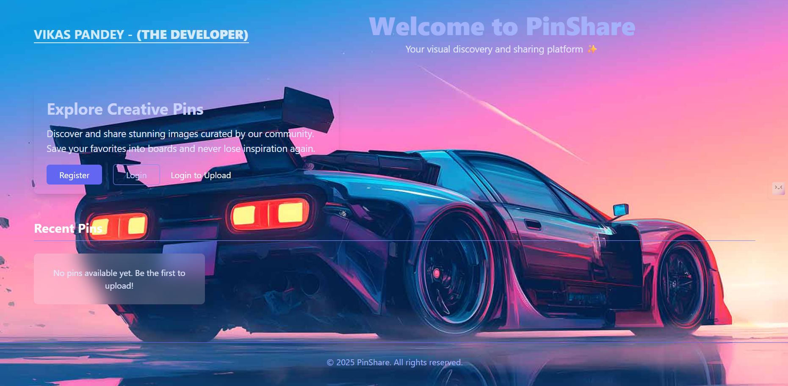
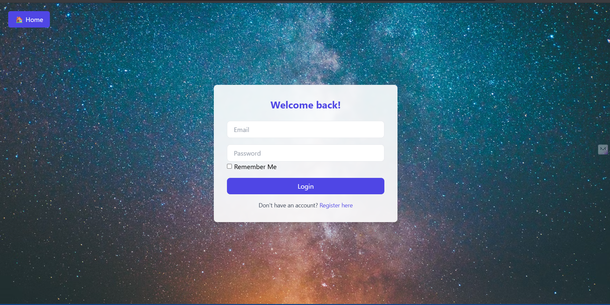
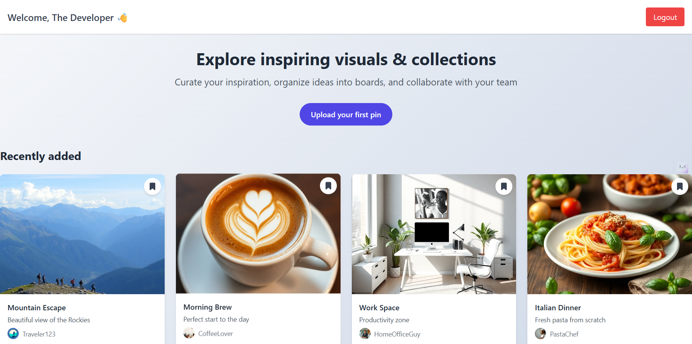
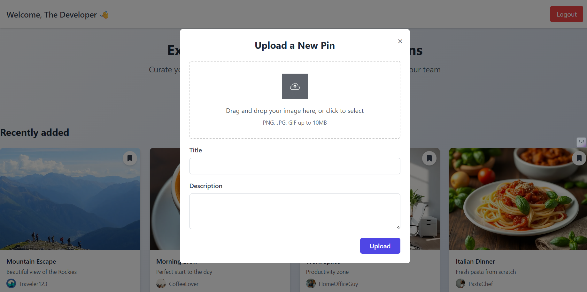

# 📌 PinBoard-Pro

**PinBoard-Pro** is a full-stack web application built using the **Node.js** ecosystem with **Express.js**, **EJS**, and **MongoDB**. It provides a Pinterest-like experience where users can register, log in, upload and manage image-based posts ("pins"), and organize them into boards.

    > A visual discovery and inspiration platform for curating creative ideas ✨

---

## 🚀 Features

- 🧑 User Authentication (Register/Login/Logout)
- 📤 Upload pins (image + title + description)
- 🧠 Boards for organizing pins
- 🌐 Responsive UI with TailwindCSS
- 💾 All data (images, users, pins) are saved in MongoDB
- 📸 Image uploads stored locally in `public/uploads/`

---

## 🛠️ Tech Stack

| Layer         | Technology            |
|--------------|------------------------|
| Frontend     | HTML, TailwindCSS, EJS |
| Backend      | Node.js, Express.js    |
| Database     | MongoDB, Mongoose      |
| Auth         | express-session + MongoStore |
| File Uploads | multer                 |
| Templating   | EJS                    |

---

## 📂 Project Structure

PinBoard-Pro/
├── config/
│ └── db.js # MongoDB connection logic
├── models/
│ ├── user.js # User schema
│ └── Pin.js # Pin schema
├── public/
│ └── uploads/ # Uploaded images stored here
├── routes/
│ ├── auth.js # Register/Login/Logout routes
│ ├── pins.js # Pin upload/delete logic
│ └── boards.js # Boards creation/viewing
├── views/
│ ├── index.ejs # Home page
│ ├── upload.ejs # Upload pin modal and display
│ └── ...
├── .env # Environment variables (Mongo URI, etc.)
├── app.js # Main app file
|─── Screenshots
└── README.md # You are here!

## 🧪 How to Run Locally

### ✅ Prerequisites:
- Node.js installed
- MongoDB running locally or a connection string for Atlas

### 📦 Setup Steps:

```bash
git clone https://github.com/your-username/PinBoard-Pro.git
cd PinBoard-Pro
npm install

▶️ Start the app:
node app.js
Visit: http://localhost:3000

📸 Screenshots-:

### Home Page
 ;
;
;
;
.png);
;


